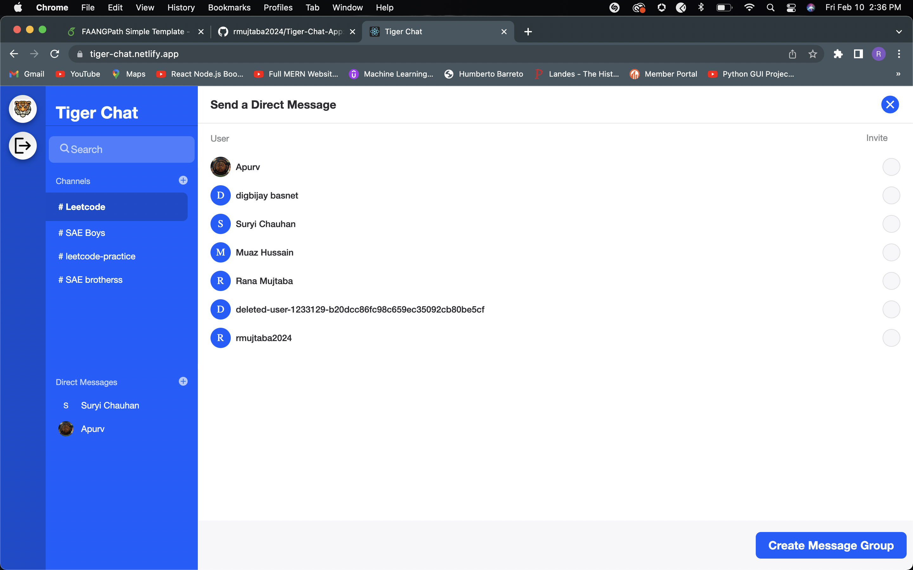

<h2> Tiger Chat Web App </h2>
<h4> JavaScript, React, Node.js, Stream </h4>

This project is a full-stack real-time messaging web app that I built. The app has several cool features, like direct messages, group chats, and message notifications through Twilio. It also supports emojis, message reactions, threads, and even gifs! The app is built using Javascript, React, Node.js, and Stream.io. I really enjoyed working on this project because it allowed me to combine my passion for coding with my interest in creating a useful and engaging messaging app. Overall, I'm really proud of what I was able to accomplish with this project and I think it showcases my skills as a full-stack developer.

Deployed the backend on heroku https://dpu-tiger-chat.herokuapp.com/, and the front end on netlify.

